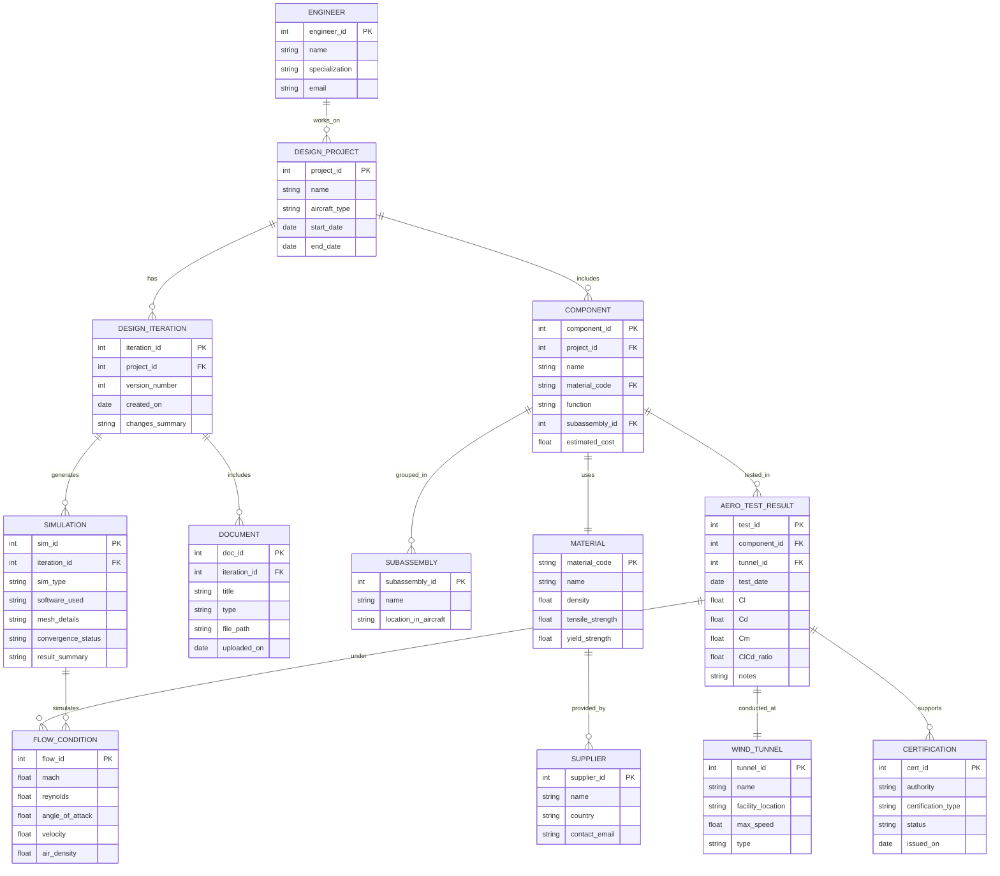

# Aerospace Engineering ERD (Mermaid)

```mermaid
erDiagram
    ENGINEER ||--o{ DESIGN_PROJECT : works_on
    DESIGN_PROJECT ||--o{ DESIGN_ITERATION : has
    DESIGN_PROJECT ||--o{ COMPONENT : includes
    DESIGN_ITERATION ||--o{ SIMULATION : generates
    DESIGN_ITERATION ||--o{ DOCUMENT : includes
    COMPONENT ||--o{ SUBASSEMBLY : grouped_in
    COMPONENT ||--|| MATERIAL : uses
    MATERIAL ||--o{ SUPPLIER : provided_by
    COMPONENT ||--o{ AERO_TEST_RESULT : tested_in
    AERO_TEST_RESULT ||--|| WIND_TUNNEL : conducted_at
    AERO_TEST_RESULT ||--o{ FLOW_CONDITION : under
    AERO_TEST_RESULT ||--o{ CERTIFICATION : supports
    SIMULATION ||--o{ FLOW_CONDITION : simulates

    ENGINEER {
        int engineer_id PK
        string name
        string specialization
        string email
    }

    DESIGN_PROJECT {
        int project_id PK
        string name
        string aircraft_type
        date start_date
        date end_date
    }

    DESIGN_ITERATION {
        int iteration_id PK
        int project_id FK
        int version_number
        date created_on
        string changes_summary
    }

    COMPONENT {
        int component_id PK
        int project_id FK
        string name
        string material_code FK
        string function
        int subassembly_id FK
        float estimated_cost
    }

    SUBASSEMBLY {
        int subassembly_id PK
        string name
        string location_in_aircraft
    }

    MATERIAL {
        string material_code PK
        string name
        float density
        float tensile_strength
        float yield_strength
    }

    SUPPLIER {
        int supplier_id PK
        string name
        string country
        string contact_email
    }

    DOCUMENT {
        int doc_id PK
        int iteration_id FK
        string title
        string type
        string file_path
        date uploaded_on
    }

    SIMULATION {
        int sim_id PK
        int iteration_id FK
        string sim_type
        string software_used
        string mesh_details
        string convergence_status
        string result_summary
    }

    FLOW_CONDITION {
        int flow_id PK
        float mach
        float reynolds
        float angle_of_attack
        float velocity
        float air_density
    }

    AERO_TEST_RESULT {
        int test_id PK
        int component_id FK
        int tunnel_id FK
        date test_date
        float Cl
        float Cd
        float Cm
        float ClCd_ratio
        string notes
    }

    WIND_TUNNEL {
        int tunnel_id PK
        string name
        string facility_location
        float max_speed
        string type
    }

    CERTIFICATION {
        int cert_id PK
        string authority
        string certification_type
        string status
        date issued_on
    }
```
